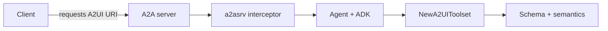

# A2UI Go extension

[](LICENSE)

Go libraries for the **[A2UI](https://a2ui.org/)** (Agent-to-UI) **[A2A](https://a2a-protocol.org/)** extension: validated UI message streams for agents, capability helpers, and optional **[a2a-go](https://github.com/a2aproject/a2a-go)** server wiring.

## Features

- **ADK tools** (`tools`) — `generate_a2ui_messages` [function tool](https://pkg.go.dev/google.golang.org/adk/tool/functiontool) with JSON Schema derived from the A2UI v0.9 server-to-client message list, plus semantic checks (e.g. `id: "root"` per surface).
- **Capabilities** (`kit`) — Store and read A2UI extension params on `context.Context`; parse `supportedCatalogIds` and `inlineCatalogs`.
- **A2A server** (`a2asrv`) — Ready-made `AgentExtension` metadata (catalog URIs, `acceptsInlineCatalogs`) and a `CallInterceptor` that activates the extension when the client requests it.

## Packages

| Import path | Role |
|-------------|------|
| `go.alis.build/a2a/extension/a2ui` | Root package (documentation only; see `docs.go`). |
| `go.alis.build/a2a/extension/a2ui/tools` | ADK tools and inlined JSON Schema. |
| `go.alis.build/a2a/extension/a2ui/kit` | Context keys and catalog parsing. |
| `go.alis.build/a2a/extension/a2ui/a2asrv` | Agent extension + interceptor for `github.com/a2aproject/a2a-go/v2/a2asrv`. |

## Architecture (high level)

1. **Discovery** — Servers advertise [`a2asrv.AgentExtension`](a2asrv/extension.go) so clients learn supported catalog IDs and whether inline catalogs are allowed.
2. **Negotiation** — When the client requests the A2UI extension URI, [`a2asrv.NewInterceptor`](a2asrv/interceptor.go) can activate the extension on the call.
3. **Runtime** — Agent code uses [`kit.WithA2UICapabilities`](kit/capabilities.go) (or your own wiring) so [`tools.NewA2UIToolset`](tools/tool.go) only exposes the A2UI tool when capabilities are present.
4. **Generation** — The model calls `generate_a2ui_messages` with a `messages` array; validation runs against the inlined schema in [`tools/schema.go`](tools/schema.go) and [`tools/utils.go`](tools/utils.go).



## Installation

```bash
go get go.alis.build/a2a/extension/a2ui@latest
```

Replace with your module path or version tag once this module is published.

## Getting started

### Advertise the extension

Use [`a2asrv.AgentExtension`](a2asrv/extension.go) in your agent’s extension list or agent card so clients see supported catalogs and flags.

### Register the call interceptor

If you use **a2a-go**’s server stack, register [`a2asrv.NewInterceptor`](a2asrv/interceptor.go) so incoming calls that list the A2UI extension URI activate [`AgentExtension`](a2asrv/extension.go) on the call context. Adjust wiring to match your server API (see `github.com/a2aproject/a2a-go/v2/a2asrv`).

### Expose the ADK tool

1. Attach A2UI capability data to the agent context when appropriate ([`kit.WithA2UICapabilities`](kit/capabilities.go)).
2. Add [`tools.NewA2UIToolset`](tools/tool.go) to your agent’s toolsets so the model can emit validated `messages` arrays.

## Documentation

- **Go doc comments** — This module uses idiomatic Go documentation (the standard analogue of **JSDoc** for Go). Browse locally:

  ```bash
  go doc go.alis.build/a2a/extension/a2ui/...
  ```

- **Package overviews** — See `docs.go` at the repository root and under `tools/`, `kit/`, and `a2asrv/` for package-level narratives.
- **Specification** — A2UI message shapes and semantics are defined by [A2UI](https://a2ui.org/) (v0.9 server-to-client list schema).

## License

Apache 2.0 — see [LICENSE](LICENSE).
