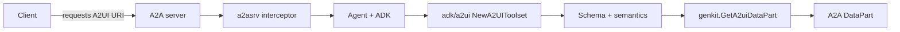

# A2UI Go A2A Extension

[](LICENSE)

A2A-specific wiring for the **[A2UI](https://a2ui.org/)** (Agent-to-UI) extension: capability negotiation, server integration with **[a2a-go](https://github.com/a2aproject/a2a-go)**, and bridging ADK function responses to A2A data parts.

Transport-agnostic ADK tools (schema validation, tool definitions) live in [`go.alis.build/adk/a2ui`](https://pkg.go.dev/go.alis.build/adk/a2ui).

## Features

- **A2A server** (`a2asrv`) — Ready-made `AgentExtension` metadata (catalog URIs, `acceptsInlineCatalogs`) and a `CallInterceptor` that activates the extension when the client requests it.
- **Capabilities** (`kit`) — Extract A2UI client capability params from A2A executor message metadata (`a2uiClientCapabilities` → `v0.9`) onto `context.Context` when A2UI is activated.
- **GenAI bridge** (`genkit`) — Convert ADK `genai.Part` function responses into `a2a.Part` data parts with `application/json+a2ui` mime type.

## Packages

| Import path | Role |
|-------------|------|
| `go.alis.build/a2a/extension/a2ui` | Root package (documentation only; see `docs.go`). |
| `go.alis.build/a2a/extension/a2ui/a2asrv` | Agent extension + interceptor for `github.com/a2aproject/a2a-go/v2/a2asrv`. |
| `go.alis.build/a2a/extension/a2ui/kit` | A2A-specific capability extraction (delegates to `go.alis.build/adk/a2ui/kit`). |
| `go.alis.build/a2a/extension/a2ui/genkit` | Bridges `genai.Part` → `a2a.Part` for A2UI tool responses. |

## Architecture (high level)

1. **Discovery** — Servers advertise [`a2asrv.AgentExtension`](a2asrv/extension.go) so clients learn supported catalog IDs and whether inline catalogs are allowed.
2. **Negotiation** — When the client requests the A2UI extension URI, [`a2asrv.NewInterceptor`](a2asrv/interceptor.go) activates the extension on the call.
3. **Runtime** — Call [`kit.WithA2UICapabilities`](kit/capabilities.go) with the current `context.Context` and `*sdka2asrv.ExecutorContext` so client capabilities from `execCtx.Message.Metadata` are available to toolset filters via `kit.CapabilitiesFromContext`.
4. **Tools** — Use [`go.alis.build/adk/a2ui/v09/tools.NewA2UIToolset`](https://pkg.go.dev/go.alis.build/adk/a2ui/v09/tools) in your agent; it exposes the A2UI tool only when capabilities are present on the context.
5. **Response bridging** — After the model calls `generate_a2ui_messages`, use [`genkit.GetA2uiDataPart`](genkit/data_part.go) to extract validated messages and wrap them as an A2A data part.


```mermaid
flowchart LR
  Client[Client] -->|requests A2UI URI| Server[A2A server]
  Server --> Interceptor[a2asrv interceptor]
  Interceptor --> Agent[Agent + ADK]
  Agent --> Toolset["adk/a2ui NewA2UIToolset"]
  Toolset --> Validate[Schema + semantics]
  Validate --> Bridge["genkit.GetA2uiDataPart"]
  Bridge --> Response[A2A DataPart]
```

## Installation

```bash
go get go.alis.build/a2a/extension/a2ui@latest
```

## Getting started

### Advertise the extension

Use [`a2asrv.AgentExtension`](a2asrv/extension.go) in your agent's extension list or agent card so clients see supported catalogs and flags.

### Register the call interceptor

If you use **a2a-go**'s server stack, register [`a2asrv.NewInterceptor`](a2asrv/interceptor.go) so incoming calls that list the A2UI extension URI activate [`AgentExtension`](a2asrv/extension.go) on the call context.

### Expose the ADK tool

1. From your executor path, pass the ADK/`a2asrv` context and [`sdka2asrv.ExecutorContext`](https://pkg.go.dev/github.com/a2aproject/a2a-go/v2/a2asrv#ExecutorContext) into [`kit.WithA2UICapabilities`](kit/capabilities.go). It no-ops unless the call has an A2A `CallContext`, A2UI is activated, and metadata contains `a2uiClientCapabilities` with a `v0.9` object.
2. Add [`go.alis.build/adk/a2ui/v09/tools.NewA2UIToolset`](https://pkg.go.dev/go.alis.build/adk/a2ui/v09/tools) to your agent's toolsets.
3. Use [`genkit.GetA2uiDataPart`](genkit/data_part.go) to convert the tool response into an A2A data part.

## Documentation

- **Go doc comments** — Browse locally:

  ```bash
  go doc go.alis.build/a2a/extension/a2ui/...
  ```

- **Package overviews** — See `docs.go` at the repository root and under `kit/`, `a2asrv/`, and `genkit/` for package-level narratives.
- **Specification** — A2UI message shapes and semantics are defined by [A2UI](https://a2ui.org/) (v0.9 server-to-client list schema).

## License

Apache 2.0 — see [LICENSE](LICENSE).
